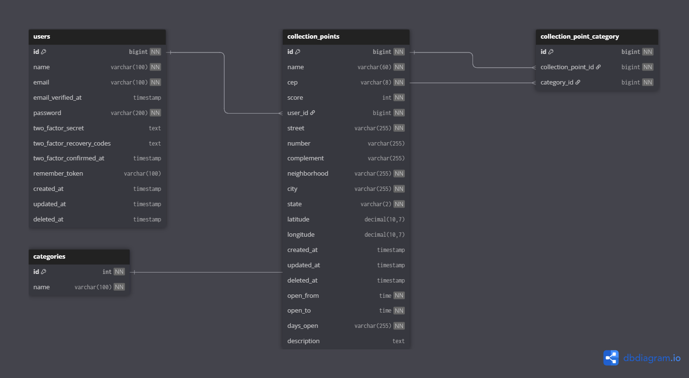

# NPR | Laravel


Este projeto é uma aplicação web com foco no auxílio às questões ambientais, com o objetivo de facilitar o compartilhamento de informações até a localização sobre pontos de coleta de diversos tipos de materiais. 

Acredito que seja um bom projeto para implementar e aprofundar meus conhecimentos no **Laravel**, de maneira a testar meu conhecimento nas suas funcionalidades essenciais e recursos extras.
## SUMÁRIO

- [Tecnologias Implementadas](#tecnologias-implementadas)
- [Operações das Entidades](#operações-das-entidades-do-sistema)
    - [Operações de Usuário](#operações-das-entidades-do-sistema)
        - [Criar Conta](#criação-de-uma-nova-conta)
        - [Apagar Conta](#apagar-conta)
        - [Login](#login---fortify)
        - [Logout](#logout---fortify)
        - [Recuperação de Senha](#recuperação-de-senha---fortify)
- [Pontos de Coleta](#pontos-de-coleta)
    - [Integração com a ViaCEP](#integração-com-a-api-da-viacep)
    - [Integração com OpenCage API](#integração-com-a-api-da-opencage)
    - [Integração com o Google My Maps](#integração-com-o-google-my-maps)
    - [Operações do Ponto de Coleta](#listar-pontos)
        - [Listar Pontos](#listar-pontos)
        - [Cadastrar Novo Ponto](#cadastrar-um-novo-ponto-de-coleta)
        - [Apagar Ponto](#apagar-ponto-de-coleta)
        - [Editar Ponto](#editar-informações-do-ponto-de-coleta)
- [Níveis de Acesso](#níveis-de-acesso)
- [Como Rodar o Projeto](#como-rodar-o-projeto-localmente)
- [Rotas](#rotas)
- [Observabilidade](#observabilidade)
    - [Tratamento de Exceções](#tratamento-de-exceçôes)
    - [Envio de Email Crítico](#envio-de-email-crítico)
- [Entidades e Banco e Dados](#entidades-e-banco-de-dados)
    - [Estrutura das Tabelas](#estrutura-das-tabelas)
    - [Relacionamentos](#relacionamentos)
- [Prótotipo e implementação](#protótipo-e-implementação)
    - [BEM-CSS e Boostrap](#bem-css-e-boostrap)
---

### TECNOLOGIAS IMPLEMENTADAS

| Tecnologia | Objetivo / Explicação                                                                                      |
|------------|-----------------------------------------------------------------------------------------------------------|
| Laravel    | Foco de estudos deste projeto, framework PHP robusto para desenvolvimento web.                             |
| Blade      | Template engine do Laravel utilizada para renderização de views e criação de componentes reutilizáveis.    |
| MySQL      | Banco de dados relacional, ideal para modelar relacionamentos entre entidades e manter integridade dos dados. |
| Fortify    | Sistema de autenticação e autorização, gerenciando o controle de acesso aos recursos do projeto.           |
| ViaCEP | API para busca de informações de endereços baseado no CEP| 
| OpenCage | API para buscar latitude e longitude de endereços |
| Google My Maps |  Ferramenta para visualização dos pontos de coleta usando mapas personalizados. Permite importar arquivos `.csv` gerados pelo sistema para exibir os locais de coleta. |

---

## OPERAÇÕES DAS ENTIDADES DO SISTEMA
O projeto se baseia em dois elementos principais: o `Usuário` e os `Pontos de Coleta` cujas funcionalidades são direcionadas a essas duas entidades.

### USUÁRIO

###### CRIAR CONTA
O usuário preenche um formulário com suas informações (nome, email, senha) e faz o envio para o sistema.

O **Fortify** valida as informações e registra o usuário, caso esteja com as informações corretas, e assim cria um novo usuário. Após isso o usuário é redirecionado para a página de login.

Após a criação do usuário o sistema envia 2 *emails*, sendo um referente à validação da conta, e o outro uma mensagem personalizada de boas-vindas.

> ⚠️*Aviso:* o usuário ainda poderá acessar alguns recursos do sistema sem essa validação mas outros recursos como a criação de novos pontos de coleta é permitida somente para *Usuários Verificados*.

###### APAGAR CONTA
Esta opção esta disponível na página de perfil do usuário, onde será encontrada em um botão cuja rota seguira para as operações necessárias para apagar a conta.

A operação esta protegida por um *middleware* que solicita a senha atual do perfil para garantir que seja uma operação válida.
 
###### LOGIN - `Fortify`
O usuário preenche as informações para login(email, senha) e faz o envio.

Novamente o **Fortify** válida as informações assim realizando o login ou retornando o usuário para a página de login com mais informações.

Após logado, o usuário tem acesso a novas funcionalidades como a criação de um novo Ponto de Coleta.

###### LOGOUT - `Fortify`  
O logout é realizado através de um botão encontrado no *header*  da aplicação.

Nada mais é de que um formulário com **POST** com design de um botão para realizar o logout atravês do `Fortify`.

Após isso o usuário será redirecionado a área de login e suas informações da sessão serão removidas.


###### RECUPERAÇÃO DE SENHA - `Fortify`

Caso o usuário esqueça sua senha, a recuperação da informação segue o seguinte fluxo: 

O usuário acessa a view responsável por exibir um formulário onde será preenchido `email` da conta a ser recuperada.

Após isso é enviado um email para ela, com as informações sobre a recuperação da senha.

Seguindo as orientações o usuário irá ser redirecionado a um formulário para preencher a nova senha e após isso é efetuado a troca de senhas do perfil.

---
### PONTOS DE COLETA

Os pontos de coleta são locais/organizações que estão a disposição para o recolhimento de materiais que serão descartados com o objetivo de garantir o melhor destino aos resíduos.

###### INTEGRAÇÃO COM A API DA [ViaCEP](https://viacep.com.br/)
O uso da api é feito a partir de uma requisição *fetch* em javascript que se encontrar resultados válidos irá substituir os campos rua, bairro, cidade e estado, automaticamente, facilitando assim o preenchimento das informações.

A requisição acontece apartir de uma chamada de função assíncrona que espera uma resposta *json* com as informações de endereço.

Caso aconteça algum erro ou não encontre as informações, o usuário será informado que deve verificar o cep ou preencher as informações a mão caso tenha certeza que a informaçãoe está correta.   

###### INTEGRAÇÃO COM A API DA [OpenCage](https://opencagedata.com/)

Para buscar as informações de latitude e longitude dos endereços, buscando diminuir a complexidade do formulário de cadastro de um novo ponto de coleta.

A *OpenCage* disponibiliza uma api que com base nas informações do endereço, retorna dados detalhados relacionados a outras informações que a *ViaCEP* não disponibiliza como `Latitude` e `Longitude` que para uma integração com mapas é de grande utilizade por facilitar a comunicação entre estes serviços.

Em relação as limitações, na busca por apis que ofereçam este tipo de serviço, a OpenCage disponibiliza um plano gratuito com uma quantidade generosa de requisições por mês, mas infelizmente sua precisão se perde por alguns bairros.

Mas dentro das limitações ela serve bem a um objetivo simples.

###### INTEGRAÇÃO COM O [Google My Maps](https://www.google.com/intl/pt-BR/maps/about/mymaps/)

O projeto conta com um mapa personalizado, feito com o *Google My Maps* que disponbiliza uma série de ferramentas para a criação de um mapa para que os usuários possam visualizar mais informações sobre os pontos de coleta.

Embora a *Google Maps API* fosse minha escolha ideal para uma integração mais dinâmica e automatizada, optei pelo uso do *Google My Maps* devido a certas limitações técnicas e de custos durante o desenvolvimento.

A atualização de informações acontece manualmente apartir da geração de um `.csv` com informações atualizadas que devem ser exportadas para a plataforma do *Google My Maps*.

Ainda estou vendo alguma maneira de conseguir buscar o ponto especifico no mapa apartir da página com mais informações sobre um ponto.


###### LISTAR PONTOS 

Acessando a home é carregado as informações dos pontos de coletas registrados no banco de dados e renderizado como cards para a visualização. 

Ao clicar em qualquer card sobre um ponto, o usuário é redirecionado para uma página com mais detalhes e informações sobre o ponto.

###### CADASTRAR UM NOVO PONTO DE COLETA
Para cadastrar um novo Ponto de Coleta, é realizar o preenchimento do formulário com as seguintes informações

- Nome do Ponto de Coleta
- Cep
- Estado
- Cidade 
- Bairro
- Rua
- Número
- Complemento
- Tipo de coleta
- Horario de funcionamento
- Dias de funcionamento
- Descrição (opcional)

Apesar de extensas, acredito serem informações importantes para o registro de novas informações.

>:bulb:*Dica sobre o Formulário:* o formulário disponibiliza um autopreencher das informações com o CEP fornecido, onde após o preenchimento do campo, será buscado as informações a partir da *api* da [ViaCEP](https://viacep.com.br/)

Após preencher e realizar o envio, o sistema irá validar as informações usando a classe `Requests/CollectionPoint/StoreRequest` para realizar a verificação dos campos com base em regras especificas para cada campo, caso não tenha problemas seguira o fluxo até o `CollectionPointController` para realizar a inserção no banco de dados.

Neste ponto, será válidade primeiro se os horários de funcionamento são coerentes, evitando assim que um horário de abertura seja maior que o horário de fechamento 

**Exemplo:** Se o local abre as 12:00 e fecha as 06:00 não será uma informação válida para o sistema e irá retornar para a página de cadastro com um aviso.

Após isso, o `array` de informações sobre os dias da semana que abre, será formatado como string.

O CEP irá ser formatado para remover a pontuação.

Após isso é realizado o registro das informações no banco de dados na entidade `collection_points` e após isso com base nas informações das categorias será registrado na tabela pivô entre os pontos de coleta e as categorias suas respectivas categorias.


>⚠️ *Aviso sobre permissões:* somente usuários que validaram sua conta através da verificação por email podem realizar realizar esta tarefa 

###### APAGAR PONTO DE COLETA
Para apagar um Ponto de Coleta o usuário deve estar na página de visualização do ponto e deve ser o **mesmo usuário que cadastrou o Ponto de Coleta**, caso contrário nenhuma opção sera mostrada.

O mesmo se aplica a questão de *Editar* as informações do Ponto de Coleta

###### EDITAR INFORMAÇÕES DO PONTO DE COLETA
A alteração de informações de um Ponto de Coleta esta disponivel a partir de um modal com um formulário com as informações atuais do Ponto de Coleta, onde **somente o usuário que registrou o Ponto de Coleta** terá acesso a estas informações e funcionalidades.

O mesmo se aplica a questão de *Apagar* um Ponto de Coleta do banco de dados.

---
## NÍVEIS DE ACESSO
O projeto esta disponivel a partir de 3 níveis de acesso, sendo eles:
 *guest*, *usuário* e *usuário verificado* 

#### GUEST
Usuário não logado, acesso restrito as funcionalidades básicas, sendo necessário realizar *Login* para acessar qualquer rota da aplicação.

O usuário que não estiver logado pode acessar recursos limitados, sendo eles a home que mostra todos os pontos de coleta cadastrado, podendo ver as páginas com mais detalhes, o mapa disponível e as telas de login e cadastro.

Para acessar os recursos restantes como a criação de pontos de coleta ele deve criar e validar uma conta nova.

#### USUÁRIO
Mesmo após criar uma conta e realizar o *Login* o usuário deve validar sua conta atravês do link enviado para o seu *email* sem isso ele não pode cadastrar novos pontos de coletas.
Apesar disso ele pode acessar o restante das funcionalidades do projeto como as páginas de perfil e dos pontos de coleta já cadastrados.

#### USUÁRIO VERIFICADO
Após a validação do perfil atravês do link enviado para o *email* do usuário, ele terá total acesso às funcionalidades do projeto, podendo criar e editar novos pontos de coleta.

--- 

## COMO RODAR O PROJETO LOCALMENTE

1. Clone o repositório
```bash
    git clone https://github.com/seu-usuario/npr.git
    cd npr
```

Após isso use o comando `cd` para acessar a pasta do projeto

2. Instale as dependências
```bash
    composer update
```
Com isso o *composer* irá carregar todos os arquivos necessários para o projeto funcionar

3. Configure o arquivo de configurações `.env`
```
    cp .env.example .env
    php artisan key:generate    
```
Altere as informações do `.env` com base nas informações de configurações do seu banco de dados para poder acessa-lo.

4. Rode as migrações e seeders
```bash
    php artisan migrate --seed
```
Com este comando o artisan será encarregado de realizar a criaçao de todas as tabelas necessárias e junto do `--seed` irá criar alguns registros para poder testar as funcionalidades básicas

5. Inicie o servidor local
```bash
    php artisan serve
```

Após estas etapas se tudo ocorrer bem, a aplicação estara disponível localmente atravês da rota `http://localhost:8000/`
Se a porta `8000` estiver ocupada será informado uma nova rota para acesso.

#### SEEDER

Seguindo o passo 4 será inserido no banco de dados as seguintes informações

- USUÁRIOS (2 registros)
    Serão inseridos dois usuários base, um com todas as verificações e outro com a necessidade de validar o email

| nome | email | senha | observação |
|-------|------|------|-----|
| Admin| admin@gmail.com | 123456| Acesso total a todas as funcionalidades |
| John Doe | john_doe@gmail.com  | 123456 | Acesso restrito, necessário validação do email |

Também será criado as categorias base e alguns registros de pontos de coleta que serão renderizados na home page do projeto para visualização.
        
---

## ROTAS

A seguir esta as rotas disponiveis pelo projeto, para um melhor contexto aqui esta uma breve explicação dos middlewares.

auth: Usuários logados
verified: Contas que válidas(validação via email)
password.confirm: para acessar é necessário inserir a senha do usuário

### ROTAS PÚBLICAS

| Método | Rota    | Nome (alias) | Controller / Ação | Descrição                                     | Middlewares |
|--------|---------|--------------|-------------------|-----------------------------------------------|-------------|
| GET    | /       | –            | (Closure)         | Verifica conexão com o BD e redireciona login ou erro | Nenhum     |
| GET    | /notes  | notes        | (Closure)         | Exibe view de notas                            | Nenhum     |


### ROTAS AUTENTICADAS (auth)

| Método | Rota                  | Nome (alias)             | Controller / Ação              | Descrição                                           | Middlewares          |
|--------|-----------------------|--------------------------|-------------------------------|-----------------------------------------------------|----------------------|
| GET    | /home                 | home                     | MainController@index           | Página inicial do sistema após login                | auth                 |
| GET    | /ponto-de-coleta/{id} | collection_point.view    | MainController@view            | Exibe detalhes de um Ponto de Coleta específico     | auth                 |
| GET    | /perfil/{id}          | me.profile             | MainController@profile         | Exibe perfil do usuário                              | auth                 |

### ROTAS AUTENTICADAS E VERIFICADAS (auth + verified)

| Método | Rota                | Nome (alias)           | Controller / Ação               | Descrição                                         | Middlewares          |
|--------|---------------------|------------------------|-------------------------------|---------------------------------------------------|----------------------|
| GET    | /ponto-de-coleta    | collection_point.index | MainController@collectionPoint | Lista todos os pontos de coleta                    | auth, verified       |
| GET    | /mapa               | map                    | MainController@map             | Exibe mapa com pontos de coleta                    | auth, verified       |
| POST   | /ponto-de-coleta    | collection_point.store | CollectionPointController@store | Cadastra um novo Ponto de Coleta                   | auth, verified       |


### ROTAS DE AÇÃO DO USUÁRIO (auth + verified + password.confirm)

| Método | Rota                  | Nome (alias)           | Controller / Ação               | Descrição                                          | Middlewares                    |
|--------|-----------------------|------------------------|-------------------------------|----------------------------------------------------|-------------------------------|
| PUT    | /user/{id}            | me.update            | UserController@update          | Atualiza dados do usuário                           | auth, verified, password.confirm |
| DELETE | /user/{id}            | me.destroy           | UserController@destroy         | Apaga conta do usuário                              | auth, verified, password.confirm |


### ROTAS DE AÇÃO DOS PONTOS DE COLETA (auth + verified + password.confirm)

| Método | Rota                  | Nome (alias)             | Controller / Ação               | Descrição                                          | Middlewares                    |
|--------|-----------------------|--------------------------|-------------------------------|----------------------------------------------------|-------------------------------|
| PUT    | /ponto-de-coleta/{id} | collection_point.update  | CollectionPointController@update | Atualiza dados de Ponto de Coleta                   | auth, verified, password.confirm |
| DELETE | /ponto-de-coleta/{id} | collection_point.destroy | CollectionPointController@destroy | Remove Ponto de Coleta                              | auth, verified, password.confirm |

---

## OBSERVABILIDADE
Com o crescimento do projeto e aumento de métodos que podem lançar exceções, é necessário pensar em implementar soluções para se preparar e entender que problemas estão acontecendo no código sem que isso fique exposto para os usuários. 

Imagine que deu um erro em uma chamada interna de serviços e que a mensagem de erro traga alguma informação sensível sobre o sistema, seria um erro terrível de observabilidade e arquitetura do sistema.

Para isso, em métodos que podem lançar exceções (principalmente uso de Models) foi implementado um *handler* para fazer o `Log` dos erros e mensagens genéricas para o usuário, e junto disso um envio automático de um *email* onde hipoteticamente iria para o responsável do sistema(no caso eu) as informações do erro.

Para garantir o fluxo de informações, acabei por criar uma camada de Service da qual sempre irá logar tanto o erro quanto o envio do email se foi enviado com sucesso ou caso tenha dado algum problema. Em ambos os casos o `Log` acontece ao mesmo tempo. 

###### TRATAMENTO DE EXCEÇÔES
Um dos pontos essenciais para que um projeto não tenha encerramentos repentinos em seu fluxo, é o tratamento de exceções durante o desenvolvimento.

Com o uso de blocos `try-catch` em operações que podem lidar com exceções como o uso de pacotes, comunicação com serviços externos e comunicação com o banco de dados, terá assim uma segurança maior em relação a eventos que possam acontecer e garantir que o sistema esteja protegido contra isso. 

Enquanto isso os erros são guardados em arquivos de logs usando um canal personalizado para o projeto.

Para erros críticos em funcionalidades essenciais como um erro de conexão de banco de dados, além do sistema de `Log` implementei um handler com o envio de email para no momento em que algum problema for identificado, que seja rapidamente encontrado pela equipe de desenvolvimento.

###### ENVIO DE EMAIL CRÍTICO 

Ao ser lançado uma exceção do tipo `QueryException` será interpretada como um erro de conexão com o banco de dados que deve ser verificado o quanto antes.
 
Após isso o handler `handleCriticalException` que vai logar o erro em `npr.log` e em seguida, fazer a chamada para o job `SystemErrorNotificationJob` que se responsabiliza pelo envio do email de forma assíncrona.

Caso aconteça de o envio de email também falhar, como o envio acontece atravês de um service que está encarregado de lidar com o resultado do envio, é logado junto do erro e uma mensagem informando que o email não foi enviado.

Se não acontecer e ocorrer tudo bem também é guardado uma mensagem informando que o email foi enviado com sucesso e o responsável recebe a mensagem de erro sem a necessidade de entrar no sistema.


## ENTIDADES E BANCO DE DADOS
O uso de um banco de dados relacional como o *MySQL* parece uma escolha certa quando vou pensar no escopo do projeto, estrutura de dados fixos e relacionamentos entre entidades trazem muitos benefícios com a estrutura do projeto, a partir do momento em que as informações que vão ser utilizadas são fixas e possuem relacionamentos com um certo nivel de complexidade.

Com isso o uso de um banco de dados relacional se mostra uma ótima escolha, seja por estrutura ou por escalabilidade.

#### ESTRUTURA DAS TABELAS




###### RELACIONAMENTOS
Explicação sobre os relacionamentos entre as tabelas

*users 1 ------ n collection_points*
*(OneToMany)*

Relacionamento de um para muitos, um usuário pode ter vários pontos de coleta registrados, e um Ponto de Coleta tem apenas um usuário como "dono".

*collection_points n ------ n categories* 
*(ManyToMany)*

Relacionamento muitos para muitos, onde um Ponto de Coleta pode estar relacionado a diversas categorias, e uma categoria pode estar ligada com vários pontos de coleta. 

Neste caso foi necessário a criação de uma tabela pivô para o gerenciamento entre este relacionamento. 


#### PROTÓTIPO E IMPLEMENTAÇÃO 

Durante o desenvolvimento do projeto, acabei por manter o foco no desenvolvimento do sistema, assim acabei por criar páginas simples somente para visualizar o essencial.

Com o avanço atual, acredito que seja um bom momento para dar um foco maior no design da aplicação, com isso seguirei um protótipo desenvolvido por mim a alguns meses. 


Será necessário realizar algumas alterações com base em mudanças que aconteceram durante o desenvolvimento, algumas escolhas que eu havia feito para o protótipo não são tão coesas quando falamos sobre Usabilidade e Responsividade.

>*💡Link para o protótipo:* [Figma](https://www.figma.com/proto/kqSC0SenHVFGteao7iXU4s/NPR?node-id=47-150&t=Nlp0cxyyPYAvJCA0-0&scaling=min-zoom&content-scaling=fixed&page-id=0%3A1&starting-point-node-id=4%3A34)

###### BEM-CSS E BOOSTRAP

Embora a biblioteca Bootstrap seja extremamente poderosa para a criação de layouts, seu uso nem sempre é ideal quando o objetivo é criar uma identidade visual marcante e única. Isso não significa, entretanto, que o Bootstrap não possa ser utilizado.

Ao aplicar a metodologia BEM-CSS, o desenvolvimento de classes e estilos torna-se mais organizado e baseado em convenções muito úteis. A combinação da praticidade do Bootstrap com as boas práticas do BEM-CSS resulta em uma abordagem poderosa para a criação de novos layouts.


<!-- 
❌
💡
⚠️
 -->